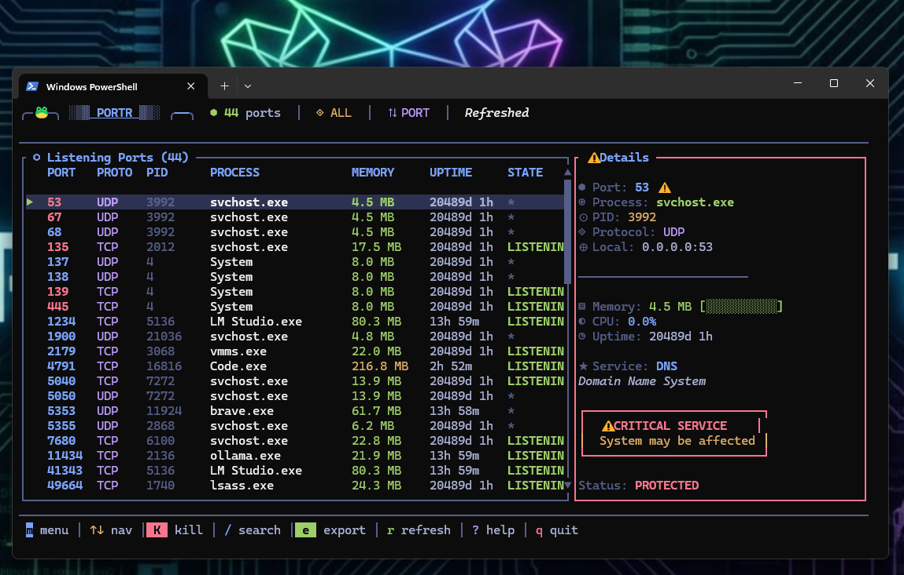
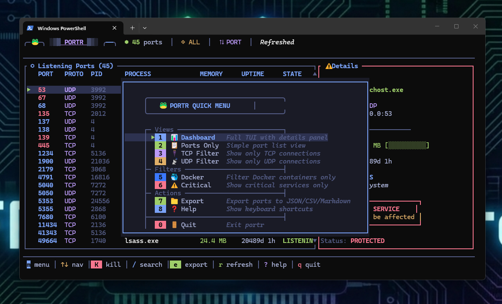
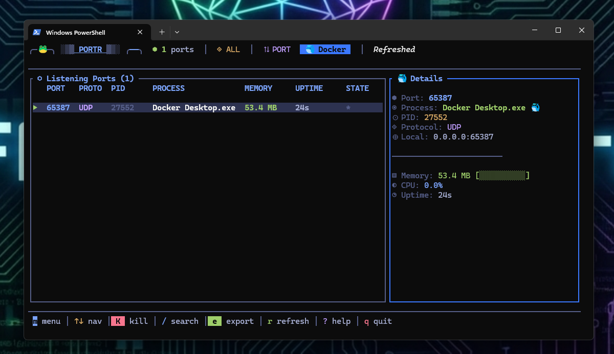
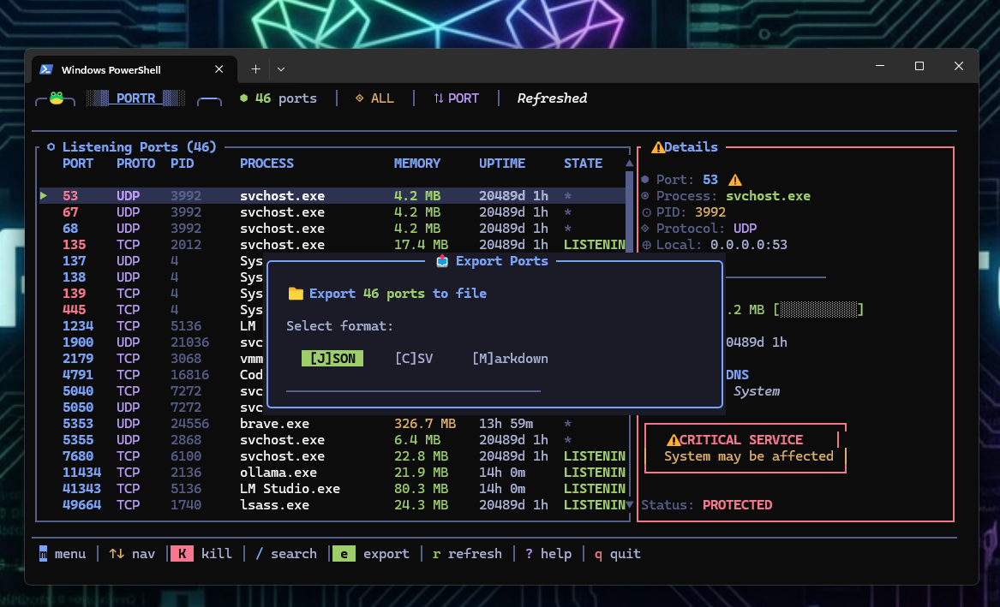
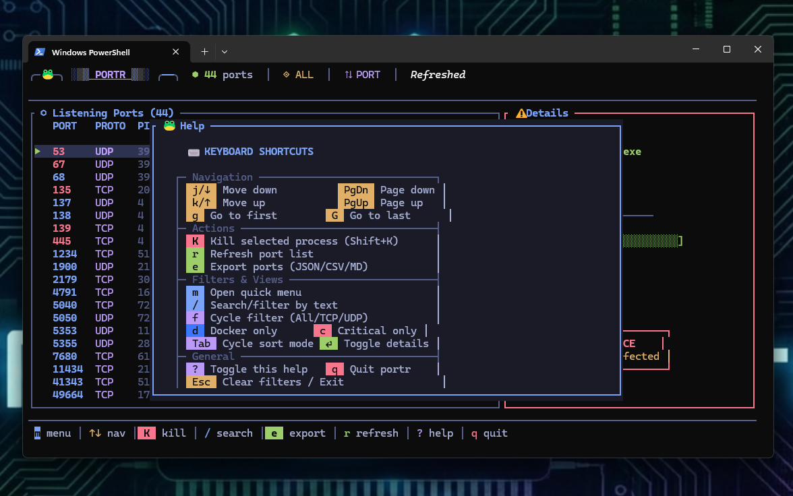

# portr

```
╔══════════════════════════════════════════════════════════════════════════╗
║                                                                          ║
║            ██████╗  ██████╗ ██████╗ ████████╗██████╗                     ║
║            ██╔══██╗██╔═══██╗██╔══██╗╚══██╔══╝██╔══██╗                    ║
║            ██████╔╝██║   ██║██████╔╝   ██║   ██████╔╝                    ║
║            ██╔═══╝ ██║   ██║██╔══██╗   ██║   ██╔══██╗                    ║
║            ██║     ╚██████╔╝██║  ██║   ██║   ██║  ██║                    ║
║            ╚═╝      ╚═════╝ ╚═╝  ╚═╝   ╚═╝   ╚═╝  ╚═╝                    ║
║                                                                          ║
║           Lightning-fast port inspector & process killer                 ║
║                                                                          ║
║                    🐸 LazyFrog | kindware.dev                            ║
║                                                                          ║
╚══════════════════════════════════════════════════════════════════════════╝
```

[](https://github.com/Brutus1066/portr/actions/workflows/ci.yml)
[](https://www.rust-lang.org/)
[](https://opensource.org/licenses/MIT)
[](https://github.com/Brutus1066/portr)
[](https://www.microsoft.com/windows)
[](https://www.linux.org/)
[](https://www.apple.com/macos)
[](https://crates.io/crates/portr)

---

## 🎯 What is portr?

**Never google "kill process on port" again.**

**portr** is a lightning-fast CLI tool that instantly shows what's using any port and lets you kill it. No more arcane `lsof`, `netstat`, or `ss` incantations.

```bash
$ portr 3000
╭─ Port 3000 ───────────────────────────────────────────────╮
│                                                           │
│        PID: 12345                                         │
│    Process: node                                          │
│   Protocol: TCP                                           │
│      State: LISTENING                                     │
│      Local: 0.0.0.0:3000                                  │
│                                                           │
│     Memory: 156.3 MB                                      │
│        CPU: 2.4%                                          │
│     Uptime: 3h 24m                                        │
│                                                           │
╰───────────────────────────────────────────────────────────╯

  → Kill: portr 3000 --kill
```

## ✨ Features

- ⚡ **Instant** — See what's using a port in milliseconds
- 🎯 **One command** — `portr 3000 --kill` does it all
- 🌐 **Cross-platform** — Windows, Linux, and macOS
- 📊 **Rich info** — PID, process name, memory, CPU, uptime
- 🖥️ **TUI Dashboard** — Beautiful real-time monitoring interface
- 🔒 **Safe** — Confirmation prompt before killing
- 📋 **Export** — JSON, CSV, and Markdown output
- 🎨 **Beautiful** — Tokyo Night themed with colored output
- 🐳 **Docker aware** — Detects and stops containers (optional feature)
- 🌲 **Process tree** — Shows parent/child relationships
- 📚 **70+ services** — Recognizes common ports with smart warnings

---

## 📸 Screenshots

### TUI Dashboard
*Real-time port monitoring with Tokyo Night theme*



### Quick Menu
*Access all features with keyboard shortcuts*



### Docker Filter
*Filter to show only Docker containers*



### Export Dialog
*Export ports to JSON, CSV, or Markdown*



### Help Overlay
*Complete keyboard shortcut reference*



---

## 📦 Installation

### From crates.io

```bash
cargo install portr
```

### From source

```bash
git clone https://github.com/Brutus1066/portr.git
cd portr
cargo build --release
```

The binary will be at `target/release/portr`.

### With Docker support (optional)

```bash
cargo install portr --features docker
# or from source:
cargo build --release --features docker
```

Docker support detects when a port is used by a Docker container and offers to stop the container instead of killing the proxy process.

### Pre-built binaries

Download from [Releases](https://github.com/Brutus1066/portr/releases):
- `portr-windows-x64.exe`
- `portr-linux-x64`
- `portr-macos-x64`
- `portr-macos-arm64`

---

## 🚀 Usage

### List all listening ports

```bash
$ portr
╭──────────┬───────┬───────┬──────────────────┬───────────┬─────────╮
│   PORT   │ PROTO │  PID  │     PROCESS      │  MEMORY   │ UPTIME  │
├──────────┼───────┼───────┼──────────────────┼───────────┼─────────┤
│ 22       │ TCP   │ 1234  │ sshd             │ 4.2 MB    │ 5d 12h  │
│ 80       │ TCP   │ 5678  │ nginx            │ 32.1 MB   │ 2d 3h   │
│ 3000     │ TCP   │ 9012  │ node             │ 156.3 MB  │ 1h 24m  │
│ 5432     │ TCP   │ 3456  │ postgres         │ 89.4 MB   │ 5d 12h  │
│ 8080     │ TCP   │ 7890  │ java             │ 512.7 MB  │ 45m     │
╰──────────┴───────┴───────┴──────────────────┴───────────┴─────────╯

● 5 port(s) in use
```

### Inspect a specific port

```bash
$ portr 3000
╭─ Port 3000 ───────────────────────────────────────────────╮
│                                                           │
│        PID: 9012                                          │
│    Process: node                                          │
│   Protocol: TCP                                           │
│      State: LISTENING                                     │
│      Local: 0.0.0.0:3000                                  │
│                                                           │
│     Memory: 156.3 MB                                      │
│        CPU: 2.4%                                          │
│     Uptime: 1h 24m                                        │
│                                                           │
╰───────────────────────────────────────────────────────────╯

  → Kill: portr 3000 --kill
```

### Kill a process on a port

```bash
$ portr 3000 --kill
╭─ Port 3000 ───────────────────────────────────────────────╮
│        PID: 9012                                          │
│    Process: node                                          │
╰───────────────────────────────────────────────────────────╯

Kill process 9012 (node)? [y/N] y
✓ Killed process 9012 (node) on port 3000
```

### Force kill without confirmation

```bash
$ portr 3000 --kill --force
✓ Killed process 9012 (node) on port 3000
```

### 🐳 Docker Support

When built with the `docker` feature, portr automatically detects Docker containers and offers to stop them instead of killing the proxy process.

```bash
# Install with Docker support
cargo install portr --features docker

# Inspect a port used by Docker
$ portr 5432
╭─ Port 5432 ───────────────────────────────────────────────╮
│        PID: 1234                                          │
│    Process: com.docker.backend                            │
│   Protocol: TCP                                           │
│      State: LISTENING                                     │
╰───────────────────────────────────────────────────────────╯

  🐳 Docker Container: my-postgres
    ID: abc123def456
    Image: postgres:15-alpine
    Status: Up 2 hours
    Ports: 5432:5432/tcp

  → Stop container: docker stop my-postgres

# Kill a Docker container safely
$ portr 5432 --kill

  🐳 Docker container detected on port 5432:
     Name: my-postgres
     ID: abc123def456
     Image: postgres:15-alpine
     Status: Up 2 hours
     Ports: 5432:5432/tcp

  ⚠ This is a CRITICAL DATABASE container!
    Stopping may cause DATA LOSS

  ? Type 'yes' to stop this container: yes
✓ Stopped container my-postgres on port 5432
```

**Safety features:**
- 🔒 **Critical containers** (postgres, mysql, redis, etc.) require typing "yes" instead of just "y"
- 📦 **Stops containers by name**, not ID, to handle container recreation
- 🎯 **No PID kills** — containers are stopped via Docker API, never by killing the proxy process

### ⚙️ Configuration

portr supports a config file for customizing defaults and creating port aliases.

**Initialize config:**
```bash
$ portr config init
✓ Created config file at: ~/.config/portr/config.toml
```

**Config file location:**
- Windows: `%APPDATA%\portr\config.toml`
- Linux/macOS: `~/.config/portr/config.toml`

**Example config:**
```toml
[defaults]
signal = "SIGTERM"   # or SIGKILL
confirm = true       # prompt before kill
color = "auto"       # auto, always, never
format = "pretty"    # pretty, json, csv, md

[aliases]
react = 3000
vite = 5173
postgres = 5432
ollama = 11434

[theme]
banner_color = "cyan"
success_color = "green"
warning_color = "yellow"
error_color = "red"
```

**Using aliases:**
```bash
$ portr react
→ Resolved alias 'react' → port 3000
✓ Port 3000 is available

$ portr postgres mysql redis
→ Resolved alias 'postgres' → port 5432
→ Resolved alias 'mysql' → port 3306
→ Resolved alias 'redis' → port 6379
✓ All specified ports are available
```

**Config commands:**
```bash
portr config init    # Create default config
portr config path    # Show config file location
portr config show    # Display current settings
```

**Built-in aliases** (created by `config init`):
- `react`, `next`, `rails` → 3000
- `vite` → 5173
- `vue`, `backend` → 8080
- `angular` → 4200
- `flask` → 5000
- `django`, `api` → 8000
- `postgres` → 5432
- `mysql` → 3306
- `redis` → 6379
- `mongo` → 27017
- `ollama` → 11434
- `docker` → 2375

### Scan a port range

```bash
$ portr 3000-3010
● Found 2 port(s) in range 3000-3010:

╭──────────┬───────┬───────┬──────────────────┬───────────┬─────────╮
│   PORT   │ PROTO │  PID  │     PROCESS      │  MEMORY   │ UPTIME  │
├──────────┼───────┼───────┼──────────────────┼───────────┼─────────┤
│ 3000     │ TCP   │ 9012  │ node             │ 156.3 MB  │ 1h 24m  │
│ 3001     │ TCP   │ 9013  │ node             │ 142.1 MB  │ 1h 24m  │
╰──────────┴───────┴───────┴──────────────────┴───────────┴─────────╯
```

### Filter by protocol

```bash
$ portr --tcp      # Show only TCP ports
$ portr --udp      # Show only UDP ports
```

### JSON output

```bash
$ portr 3000 --json
{
  "port": 3000,
  "protocol": "TCP",
  "pid": 9012,
  "process_name": "node",
  "local_address": "0.0.0.0:3000",
  "state": "LISTENING",
  "memory_mb": 156.3,
  "cpu_percent": 2.4,
  "uptime_secs": 5040
}
```

### Watch mode

```bash
$ portr watch              # Watch all ports
$ portr watch 3000         # Watch specific port
$ portr watch --interval 5 # Custom refresh interval
```

### 🖥️ TUI Dashboard

portr includes a beautiful full-screen TUI dashboard for real-time port monitoring. Perfect for keeping an eye on your network activity with a modern, professional interface.

```bash
$ portr dashboard       # Launch TUI dashboard
$ portr tui             # Same thing (alias)
$ portr -i              # Interactive mode
```

**Features:**
- 📊 **Real-time monitoring** — Auto-refreshes every 2 seconds
- 🎨 **Modern Tokyo Night theme** — Beautiful dark color palette
- 🔍 **Live search** — Filter by port, process, PID, protocol
- 🐳 **Docker filter** — Show only Docker containers
- ⚠️ **Critical filter** — Highlight critical services
- 📁 **Export to file** — JSON, CSV, or Markdown
- ⌨️ **Vim-style navigation** — j/k, PgUp/PgDn, g/G

**Keyboard shortcuts:**

| Key | Action |
|-----|--------|
| `m` | Open quick menu |
| `j/↓` | Move down |
| `k/↑` | Move up |
| `PgDn/PgUp` | Page scroll |
| `g/G` | First/Last |
| `/` | Search/filter |
| `f` | Cycle filter (All/TCP/UDP) |
| `d` | Docker only filter |
| `c` | Critical services only |
| `e` | Export (JSON/CSV/MD) |
| `Tab` | Cycle sort mode |
| `K` | Kill selected process |
| `r` | Refresh ports |
| `?` | Show help |
| `Esc` | Clear filters / Exit |
| `q` | Quit |

**Export from TUI:**
Press `e` to open the export dialog. Choose JSON, CSV, or Markdown format and press Enter. The file will be saved in the current directory with a timestamp.

```
portr_export_20241215_143022.json
portr_export_20241215_143022.csv
portr_export_20241215_143022.md
```

---

## 📖 CLI Reference

```
$ portr --help
Lightning-fast port inspector and process killer

Usage: portr [OPTIONS] [PORT] [COMMAND]

Commands:
  list        List all listening ports
  dashboard   Full-screen TUI dashboard (alias: tui)
  interactive Interactive mode with TUI
  watch       Watch ports in real-time
  find        Find which process is using a port
  kill        Kill process on a specific port
  config      Manage configuration and aliases
  help        Print this message or the help of the given subcommand(s)

Arguments:
  [PORT]  Port number, range (e.g., 3000-3010), or subcommand

Options:
  -i, --interactive  Launch interactive TUI mode
  -k, --kill         Kill the process using this port
  -f, --force        Force kill without confirmation
  -n, --dry-run      Show what would be killed
  -t, --tree         Show process tree
      --tcp          Show only TCP connections
      --udp          Show only UDP connections
      --json         Output as JSON
      --csv          Output as CSV
      --md           Output as Markdown
  -v, --verbose      Verbose output with extra details
  -h, --help         Print help
  -V, --version      Print version

Examples:
  portr                  List all listening ports
  portr dashboard        Launch TUI dashboard
  portr -i               Interactive mode
  portr 3000             Inspect port 3000
  portr 3000 --kill      Kill process on port 3000
  portr 3000 -k -f       Force kill without confirmation
  portr 3000-3010        Scan port range
  portr --tcp            Show only TCP ports
  portr --csv            Export as CSV
  portr --md             Export as Markdown

🐸 LazyFrog | kindware.dev
```

---

## 🔄 Comparison

Why portr instead of...?

| Task | Traditional | portr |
|------|-------------|-------|
| Find process on port | `lsof -i :3000` | `portr 3000` |
| Kill process on port | `kill $(lsof -t -i:3000)` | `portr 3000 -k` |
| List all ports | `netstat -tlnp` | `portr` |
| Windows equivalent | `netstat -ano \| findstr :3000` | `portr 3000` |

**10+ million StackOverflow views** on "how to kill process on port" — now solved with one command.

---

## 🔒 Permissions

Some processes require elevated privileges to inspect or kill:

**Linux/macOS:**
```bash
sudo portr 80 --kill
```

**Windows:**
Run as Administrator, or:
```powershell
Start-Process portr -ArgumentList "80 --kill" -Verb RunAs
```

---

## 🛠️ Building

```bash
# Debug build
cargo build

# Release build (optimized)
cargo build --release

# Run tests
cargo test

# Run with verbose test output
cargo test -- --nocapture

# Cross-compile for Linux (from Windows/macOS)
cargo build --release --target x86_64-unknown-linux-gnu
```

---

## 🧪 Tests

```bash
$ cargo test
running 8 tests
test port::tests::test_parse_address ... ok
test port::tests::test_uptime_display ... ok
test display::tests::test_truncate ... ok
test display::tests::test_port_status_icon ... ok
test process::tests::test_needs_elevation ... ok
test integration::test_list_ports ... ok
test integration::test_port_not_found ... ok
test integration::test_json_output ... ok

test result: ok. 8 passed; 0 failed; 0 ignored
```

---

## 📄 License

This project is licensed under the **MIT License** — see the [LICENSE](LICENSE) file for details.

---

## 🐸 About

**portr** is developed by **LazyFrog** at [kindware.dev](https://kindware.dev).

- 📧 **Support:** [support@kindware.dev](mailto:support@kindware.dev)
- 🐙 **GitHub:** [github.com/Brutus1066/portr](https://github.com/Brutus1066/portr)
- 🌐 **Website:** [kindware.dev](https://kindware.dev)

---

<p align="center">
  <strong>🐸 LazyFrog | kindware.dev</strong><br>
  <em>Never google "kill process on port" again.</em>
</p>
